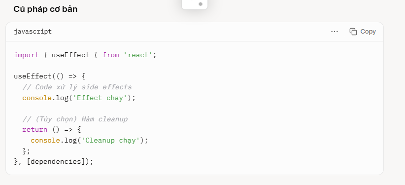

## useEffect là gì

useEffect là một React Hook trong React (từ phiên bản 16.8 trở lên) được sử dụng để xử lý các side effects (hiệu ứng phụ) trong function components. Side effects là những tác vụ không trực tiếp liên quan đến việc render giao diện, chẳng hạn như:

Gọi API để lấy dữ liệu.
Thao tác với DOM.
Đăng ký hoặc hủy đăng ký các sự kiện (event listeners).
Cập nhật state dựa trên các thay đổi khác.
Quản lý timer (setTimeout, setInterval).

